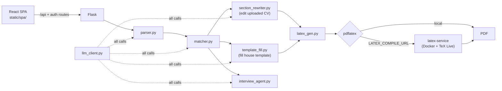

# Auto-CV

> Tailor a LaTeX CV to a specific job offer, export a polished PDF, then prep for the interview — one Flask app, one LLM layer.

Auto-CV parses a job offer, compares it against your CV, rewrites the relevant
LaTeX sections while keeping your facts intact, and shows you every proposed
change before applying it. Then it compiles the result to PDF and generates a
role-grounded interview coaching session from the same CV and job context.

It runs against either a self-hosted OpenAI-compatible server or OpenRouter,
selected by one environment variable.

## Stack

| Layer | Technology |
|---|---|
| Backend | Flask, Flask-Login, Flask-WTF, Flask-SQLAlchemy, Flask-Limiter |
| Frontend | React 19 + TypeScript SPA — Vite, React Router, HeroUI, Tailwind, Framer Motion, axios |
| AI | OpenAI-compatible chat-completions client with per-task routing |
| Documents | LaTeX generation, `pdflatex` rendering, OCR extraction |
| Database | SQLite by default, any `DATABASE_URL` |
| Tooling | `uv` (Python, authoritative), npm (frontend) |

## Quick start

Requires [uv](https://docs.astral.sh/uv/), Python 3.10+ (uv pins it from
`.python-version`), and a LaTeX distribution with `pdflatex`. Tesseract OCR is
optional but recommended for scanned CVs.

```bash
uv sync                # or: make install
cp .env.example .env   # then set your LLM provider
make start             # background on :5000
```

Open <http://127.0.0.1:5000>; the interview coach is at `/interview`.

> **`static/spa/` is committed on purpose.** The Flask lambda on Vercel reads
> `static/spa/index.html` from disk to serve the SPA, so the build output is
> checked in rather than generated at deploy time. A fresh clone therefore runs
> without building — but **if you change anything under `frontend/`, run
> `make frontend-build` and commit the result**, or production keeps serving the
> old bundle.

### Frontend dev server

For frontend work, run Vite alongside Flask instead of rebuilding each time:

```bash
make start          # Flask on :5000
make frontend-dev   # Vite on :5173 with HMR
```

Develop against <http://localhost:5173>. Vite proxies `/api` and the auth routes
(`/login`, `/logout`, `/register`, `/forgot-password`, `/reset-password`,
`/resend-verification`, `/verify-email`) to Flask on `:5000`, so the SPA sees one
origin and Flask still owns those endpoints in production.

Minimum config for a local OpenAI-compatible server:

```env
SOURCE_LLM=local
LOCAL_LLM_URL=http://localhost:8000/v1
LOCAL_LLM_MODEL=your-model-name
```

Or for OpenRouter:

```env
SOURCE_LLM=openrouter
OPENROUTER_API_KEY=your-api-key
OPENROUTER_MODEL=qwen/qwen3.6-plus
```

## Commands

| Command | Does |
|---|---|
| `make install` | `uv sync` — create `.venv`, install project + dev tools |
| `make frontend-install` | `npm install` in `frontend/` |
| `make frontend-build` | Build the SPA into `static/spa/` — run + commit after frontend changes |
| `make frontend-dev` | Vite dev server on :5173 with HMR, proxying to Flask |
| `make run` / `make start` | Foreground / background on port 5000 |
| `make stop` / `make restart` / `make status` | Manage the running app |
| `make logs` | Follow the app log |
| `make check` | `compileall` over `main.py src scripts` + `node --check static/interview.js` |
| `make test` | pytest suite |
| `make clean` | Remove runtime files and Python caches |

Frontend typecheck: `cd frontend && npm run typecheck`.

Override the port: `make start PORT=5001` (and `make stop PORT=5001`).

### Running through uv directly

The app is packaged as `autocv` under `src/`, installed editable by `uv sync`:

```bash
uv run python -m autocv                 # dev server
uv run flask --app autocv run --debug   # dev server with auto-reload
uv run auto-cv                          # console script

uv sync --extra prod                    # adds gunicorn
uv run gunicorn "autocv:create_app()"
```

`python main.py` and `gunicorn main:app` still work on a plain virtualenv.
Dependencies: `uv add <pkg>`, `uv add --dev <pkg>`, `uv lock --upgrade`.

## Features

- **Job offer analysis** — extracts skills, requirements, qualifications, and
  company info from pasted or uploaded descriptions.
- **CV matching** — matched skills, missing skills, gaps, recommendations.
- **LLM-assisted optimization** — rewrites relevant LaTeX sections without
  inventing facts.
- **Template-fill generation** — pours your real content into a fixed house
  template section by section, so every generated CV shares one polished layout.
- **Reviewable changes** — before/after diffs and optional additions you accept,
  reject, or edit.
- **PDF rendering** — compiles to PDF with automatic repair attempts for common
  LaTeX breakage.
- **Workspace history** — saved jobs and CV versions for reuse and comparison.
- **AI interview coach** — coding, system design, technical, and behavioral
  questions grounded in the role.
- **Answer review** — scores answers and surfaces weak points, role-fit risks,
  priority actions, and score evolution across a session.
- **Accounts** — login, password reset, and optional email verification.

## Architecture



**The frontend is a single-page app, and Flask is an API.** Vite builds the
React SPA into `static/spa/`; a catch-all route in `src/autocv/app.py` serves
`index.html` for any non-`/api`, non-`/static` path and lets React Router decide
what to render. Authorisation is enforced twice — `RequireAuth` gates the client
routes, and `login_required` gates the API the SPA calls. The client guard is
UX; the server guard is the actual security boundary.

Because the SPA mutates state over `fetch`, it pulls a CSRF token from
`GET /api/csrf-token` before any write.

**Every LLM call funnels through `llm_client.py`.** That one module owns
provider selection, per-task model routing, timeouts, and concurrency — nothing
else talks to a model directly. Adding a provider or re-routing a task is a
change in one file.

**Per-task model routing.** Each task (`ANALYSIS`, `SECTION_REWRITE`,
`SECTION_FILL`, `PROPOSAL`, `INTERVIEW`, `SMART_CV`, `LATEX_REPAIR`, `OCR`) can
point at a different model via `{PROVIDER}_MODEL_{TASK}` variables, falling back
to the global default. Route cheap calls to a small model and LaTeX repair to a
strong one.

**Two ways to produce a CV.** `section_rewriter.py` edits your *uploaded* CV in
place, preserving its layout. `template_fill.py` does the opposite: it pours
your content into the house template (`template_cv.tex`, 11 slots) so every
generated CV looks the same. Per slot it:

1. parses the template into preamble, ordered slots, and postamble;
2. grounds the slot in the matching part of your CV plus the job offer, asking
   the model to fill the template's structure with real facts;
3. validates the result as **LaTeX** (balanced braces and environments, no stray
   top-level commands) *and* for **faithfulness** — rejecting any skill the offer
   wants but you never listed;
4. on failure, resends the slot with the exact errors and the previous attempt,
   retrying up to `SECTION_FILL_ATTEMPTS` times before falling back safely.

Slots are independent, so they fill in parallel. A section your CV has nothing
for is **dropped** rather than fabricated — the model returns `%%OMIT%%`. The
assembled document still passes through the whole-document compile-and-repair
loop in `latex_repair.py` as a final net.

That validation step is the load-bearing part: an LLM asked to "tailor a CV to
this job" will cheerfully invent the missing skills, which is the one failure
mode that makes a generated CV worse than useless.

**Layered OCR.** Tesseract is used when installed (offline, free); otherwise the
app falls back to a vision model — which is why `*_MODEL_OCR` must be
vision-capable, unlike every other task.

**Two LaTeX compile paths.** Locally, `pdflatex` runs directly. On hosts without
a TeX toolchain (Vercel serverless), set `LATEX_COMPILE_URL` and
`LATEX_COMPILE_TOKEN` to offload to the `latex-service/` container — a stateless
microservice exposing `POST /compile` and `GET /health`. See
[`latex-service/README.md`](latex-service/README.md).

## Project structure

```
main.py                       # Backwards-compatible entry point (calls create_app)
app.py                        # Vercel serverless entry (see vercel.json)
template_cv.tex               # ★ house template filled by template_fill.py (11 slots)
src/autocv/
  app.py                      # Flask application factory, API routes, SPA catch-all
  __main__.py                 # `python -m autocv`
  llm_client.py               # ★ central LLM provider + per-task routing
  parser.py                   # Job description parsing
  matcher.py                  # CV/job matching and optimization orchestration
  section_rewriter.py         # Edits the uploaded CV in place (parallel)
  template_fill.py            # ★ fills template_cv.tex slot by slot, with validation
  latex_repair.py             # Whole-document compile-and-repair loop
  interview_agent.py          # Interview generation and answer review
  workspace.py                # Saved jobs and CV version history
  latex_gen.py                # LaTeX helpers and sample CV generation
  assets/fonts/               # DejaVu fonts for the pure-Python PDF path

frontend/                     # React 19 + TypeScript SPA (Vite)
  src/
    App.tsx                   #   route table
    main.tsx                  #   entry point
    layouts/                  #   AppShell (signed in), AuthShell (signed out)
    pages/                    #   Landing, Login, Register, Forgot/ResetPassword,
                              #   Demo, HowItWorks, Privacy, Terms,
                              #   Optimizer, Interview, Workspace, Account
    contexts/                 #   AuthContext, ToastContext
    components/RequireAuth    #   client-side route guard
    lib/api.ts                #   axios client + CSRF handling
  vite.config.ts              #   builds to ../static/spa, proxies /api in dev

latex-service/                # Standalone Docker compile service (TeX Live)
static/spa/                   # Built SPA — committed (Vercel lambda reads it from disk)
templates/                    # LaTeX templates (HTML templates now served by the SPA)
tests/                        # pytest suite + fixtures + integration tests
scripts/                      # Smoke/dev scripts
docs/                         # Developer documentation
examples/                     # Example CV and job material
instance/                     # Local SQLite database (not for production)
```

## Workflows

**CV optimization** — paste or upload a job offer → parse it → upload a CV
(LaTeX, PDF, Word, image, or plain text) → analyze the match → generate an
optimized LaTeX CV → review proposed changes → render and download the PDF →
save the job and CV version to the workspace.

**Interview prep** — reuse the CV and job context (or paste new) → choose
seniority, domains, focus, and question count → generate the session → answer
coding, system design, technical, and behavioral questions → request AI review
per answer → track score evolution and next practice actions.

## Routes

### SPA routes (React Router)

Rendered client-side; everything under the catch-all serves `index.html`.

| Route | Purpose | Auth |
|---|---|---|
| `/` | Landing page | public |
| `/login`, `/register` | Sign in / create account | public |
| `/forgot-password`, `/reset-password/:token` | Password reset | public |
| `/demo` | No-login demo | public |
| `/how-it-works` | Product workflow overview | public |
| `/privacy`, `/terms` | Legal pages | public |
| `/optimizer` | CV optimizer workspace | **required** |
| `/interview` | AI interview coach | **required** |
| `/workspace` | Saved jobs and CV versions | **required** |
| `/account` | Account settings | **required** |

Unknown paths redirect to `/`.

### API routes (Flask)

| Route | Purpose |
|---|---|
| `/api/csrf-token` | Token the SPA fetches before any mutating request |
| `/api/parse-job` | Parse raw job text |
| `/api/analyze-cv` | Analyze CV against a job |
| `/api/optimize-cv` | Rewrite and optimize CV LaTeX |
| `/api/render-latex` | Compile LaTeX to PDF |
| `/api/interview/questions` | Generate session questions |
| `/api/interview/review` | Review one answer |
| `/api/llm/health` | Show active LLM provider configuration |

Auth endpoints (`/login`, `/logout`, `/register`, `/forgot-password`,
`/reset-password`, `/resend-verification`, `/verify-email`) remain server-side
Flask routes and are proxied by Vite in development.

## Configuration

`.env.example` is heavily commented and is the real reference. The groups:

| Group | Key variables |
|---|---|
| Provider | `SOURCE_LLM` (`local` \| `openrouter`) |
| Local | `LOCAL_LLM_URL`, `LOCAL_LLM_MODEL`, `LOCAL_LLM_API_KEY` |
| OpenRouter | `OPENROUTER_API_KEY`, `OPENROUTER_BASE_URL`, `OPENROUTER_MODEL`, `OPENROUTER_MODEL_OCR` |
| Per-task routing | `{LOCAL,OPENROUTER}_MODEL_{ANALYSIS,SECTION_REWRITE,SECTION_FILL,PROPOSAL,INTERVIEW,SMART_CV,LATEX_REPAIR,OCR}` |
| Tuning | `LLM_CONNECT_TIMEOUT`, `LLM_TIMEOUT`, `LLM_MAX_WORKERS` |
| Template fill | `SECTION_FILL_ATTEMPTS` (correction round-trips per slot, default 3), `TEMPLATE_CV_PATH` (override the template file) |
| LaTeX | `LATEX_REPAIR_ATTEMPTS`, `LATEX_REPAIR_MAX_TOKENS`, `LATEX_COMPILE_TIMEOUT`, `LATEX_COMPILE_URL`, `LATEX_COMPILE_TOKEN` |
| OCR | `OCR_LANGUAGES`, `OCR_PDF_DPI`, `OCR_MAX_PAGES`, `OCR_VISION_MAX_SIDE` |
| Web | `FLASK_ENV`, `FLASK_DEBUG`, `SECRET_KEY`, `DATABASE_URL`, `MAX_CONTENT_LENGTH_MB` |
| Session & CSRF | `SESSION_COOKIE_SECURE`, `SESSION_COOKIE_SAMESITE`, `SESSION_LIFETIME_DAYS`, `WTF_CSRF_ENABLED` |
| Rate limits | `RATELIMIT_ENABLED`, `RATELIMIT_STORAGE_URI`, `RATELIMIT_{DEFAULT,LLM,AUTH,DEMO}` |
| Proxy & CORS | `PROXY_FIX_HOPS`, `CORS_ORIGINS` |
| Email | `SMTP_*`, `MAIL_FROM`, `PUBLIC_BASE_URL`, `REQUIRE_EMAIL_VERIFICATION`, token lifetimes |
| Errors | `SENTRY_DSN`, `SENTRY_TRACES_SAMPLE_RATE` |

`FLASK_ENV=development` relaxes a few safety defaults (debug allowed, insecure
cookies, ephemeral secret key). **Anything else — including unset — is treated
as production.** Never commit `.env`; it is gitignored.

With `SMTP_HOST` blank, password-reset and verification links are logged to the
console instead of emailed — fine for local dev, not for production.

## Verification

```bash
make check                            # compile checks (Python) + syntax check (JS)
make test                             # uv run pytest
cd frontend && npm run typecheck      # tsc -b --noEmit
```

The suite includes integration tests that exercise the API end to end —
`test_integration_endpoints.py`, `test_integration_journey.py`,
`test_integration_workspace.py` — plus `test_template_fill.py` covering slot
parsing, LaTeX structural validation, and the faithfulness checks.

Manual pass: start the app, parse a job offer, upload a CV,
optimize and render the PDF, then open `/interview` and review at least one
answer.

## Deployment

- Set `SECRET_KEY` in every non-local environment — generate with
  `python -c "import secrets; print(secrets.token_hex(32))"`.
- Keep `FLASK_DEBUG=0`. The Werkzeug debugger is remote code execution if exposed.
- Use a production WSGI server, not Flask's dev server.
- Point `DATABASE_URL` at PostgreSQL rather than SQLite.
- Set `RATELIMIT_STORAGE_URI` to Redis when running multiple workers, so limits
  are shared.
- Set `PROXY_FIX_HOPS` to the number of proxies in front of the app so real
  client IPs and the HTTPS scheme reach it.
- On Vercel (`vercel.json` routes everything to `app.py`), `pdflatex` is
  unavailable — deploy `latex-service/` and set `LATEX_COMPILE_URL`.
- **Commit the SPA build.** `static/spa/` is checked in because the Vercel lambda
  reads `index.html` from disk. After any change under `frontend/`, run
  `make frontend-build` and commit the output — otherwise production serves the
  previous bundle.

## Documentation

| Document | Contents |
|---|---|
| [Quick Start](docs/QUICKSTART.md) | Fastest path to a running app |
| [Installation](docs/INSTALLATION.md) | Full setup including LaTeX and OCR |
| [Development](docs/DEVELOPMENT.md) | Working on the codebase |
| [Architecture](docs/ARCHITECTURE.md) | System design |
| [API Reference](docs/API_REFERENCE.md) | Endpoint contracts |
| [Frontend](docs/FRONTEND.md) | Frontend guide — ⚠️ predates the React SPA |
| [Smart CV](docs/SMART_CV_README.md) | Smart CV generation |
| [Maintenance](docs/MAINTENANCE.md) | Operational guidance |
| [Project Summary](docs/PROJECT_SUMMARY.md) | High-level overview |
| [Roadmap](docs/ROADMAP.md) | Planned work |
| [LaTeX service](latex-service/README.md) | Standalone compile microservice |

## License

No license file is included. Add one before distributing this externally.
