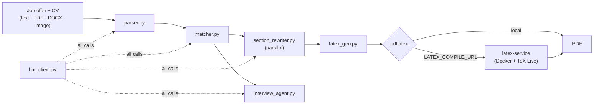

# Auto-CV

> Tailor a LaTeX CV to a specific job offer, export a polished PDF, then prep for the interview — one Flask app, one LLM layer.

Auto-CV parses a job offer, compares it against your CV, rewrites the relevant
LaTeX sections while keeping your facts intact, and shows you every proposed
change before applying it. Then it compiles the result to PDF and generates a
role-grounded interview coaching session from the same CV and job context.

It runs against either a self-hosted OpenAI-compatible server or OpenRouter,
selected by one environment variable.

## Stack

| Layer | Technology |
|---|---|
| Backend | Flask, Flask-Login, Flask-WTF, Flask-SQLAlchemy, Flask-Limiter |
| Frontend | Jinja templates, Bootstrap, custom CSS, vanilla JS |
| AI | OpenAI-compatible chat-completions client with per-task routing |
| Documents | LaTeX generation, `pdflatex` rendering, OCR extraction |
| Database | SQLite by default, any `DATABASE_URL` |
| Tooling | `uv` (authoritative), `requirements.txt` as pip fallback |

## Quick start

Requires [uv](https://docs.astral.sh/uv/), Python 3.10+ (uv pins it from
`.python-version`), and a LaTeX distribution with `pdflatex`. Tesseract OCR is
optional but recommended for scanned CVs.

```bash
uv sync                # or: make install
cp .env.example .env   # then set your LLM provider
make start             # background on :5000
```

Open <http://127.0.0.1:5000>; the interview coach is at `/interview`.

Minimum config for a local OpenAI-compatible server:

```env
SOURCE_LLM=local
LOCAL_LLM_URL=http://localhost:8000/v1
LOCAL_LLM_MODEL=your-model-name
```

Or for OpenRouter:

```env
SOURCE_LLM=openrouter
OPENROUTER_API_KEY=your-api-key
OPENROUTER_MODEL=qwen/qwen3.6-plus
```

## Commands

| Command | Does |
|---|---|
| `make install` | `uv sync` — create `.venv`, install project + dev tools |
| `make run` / `make start` | Foreground / background on port 5000 |
| `make stop` / `make restart` / `make status` | Manage the running app |
| `make logs` | Follow the app log |
| `make check` | `compileall` over `main.py src scripts` + `node --check static/interview.js` |
| `make test` | pytest suite |
| `make clean` | Remove runtime files and Python caches |

Override the port: `make start PORT=5001` (and `make stop PORT=5001`).

### Running through uv directly

The app is packaged as `autocv` under `src/`, installed editable by `uv sync`:

```bash
uv run python -m autocv                 # dev server
uv run flask --app autocv run --debug   # dev server with auto-reload
uv run auto-cv                          # console script

uv sync --extra prod                    # adds gunicorn
uv run gunicorn "autocv:create_app()"
```

`python main.py` and `gunicorn main:app` still work on a plain virtualenv.
Dependencies: `uv add <pkg>`, `uv add --dev <pkg>`, `uv lock --upgrade`.

## Features

- **Job offer analysis** — extracts skills, requirements, qualifications, and
  company info from pasted or uploaded descriptions.
- **CV matching** — matched skills, missing skills, gaps, recommendations.
- **LLM-assisted optimization** — rewrites relevant LaTeX sections without
  inventing facts.
- **Reviewable changes** — before/after diffs and optional additions you accept,
  reject, or edit.
- **PDF rendering** — compiles to PDF with automatic repair attempts for common
  LaTeX breakage.
- **Workspace history** — saved jobs and CV versions for reuse and comparison.
- **AI interview coach** — coding, system design, technical, and behavioral
  questions grounded in the role.
- **Answer review** — scores answers and surfaces weak points, role-fit risks,
  priority actions, and score evolution across a session.
- **Accounts** — login, password reset, and optional email verification.

## Architecture



**Every LLM call funnels through `llm_client.py`.** That one module owns
provider selection, per-task model routing, timeouts, and concurrency — nothing
else talks to a model directly. Adding a provider or re-routing a task is a
change in one file.

**Per-task model routing.** Each task (`ANALYSIS`, `SECTION_REWRITE`,
`PROPOSAL`, `INTERVIEW`, `SMART_CV`, `LATEX_REPAIR`, `OCR`) can point at a
different model via `{PROVIDER}_MODEL_{TASK}` variables, falling back to the
global default. Route cheap calls to a small model and LaTeX repair to a strong
one.

**Layered OCR.** Tesseract is used when installed (offline, free); otherwise the
app falls back to a vision model — which is why `*_MODEL_OCR` must be
vision-capable, unlike every other task.

**Two LaTeX compile paths.** Locally, `pdflatex` runs directly. On hosts without
a TeX toolchain (Vercel serverless), set `LATEX_COMPILE_URL` and
`LATEX_COMPILE_TOKEN` to offload to the `latex-service/` container — a stateless
microservice exposing `POST /compile` and `GET /health`. See
[`latex-service/README.md`](latex-service/README.md).

## Project structure

```
main.py                       # Backwards-compatible entry point (calls create_app)
app.py                        # Vercel serverless entry (see vercel.json)
src/autocv/
  app.py                      # Flask application factory + routes
  __main__.py                 # `python -m autocv`
  llm_client.py               # ★ central LLM provider + per-task routing
  parser.py                   # Job description parsing
  matcher.py                  # CV/job matching and optimization orchestration
  section_rewriter.py         # Section-level rewrites (parallel, LLM_MAX_WORKERS)
  interview_agent.py          # Interview generation and answer review
  workspace.py                # Saved jobs and CV version history
  latex_gen.py                # LaTeX helpers and sample CV generation
latex-service/                # Standalone Docker compile service (TeX Live)
templates/                    # Flask HTML + LaTeX templates
static/                       # JS, CSS, assets
tests/                        # pytest suite + fixtures
scripts/                      # Smoke/dev scripts
docs/                         # Developer documentation
examples/                     # Example CV and job material
instance/                     # Local SQLite database (not for production)
```

## Workflows

**CV optimization** — paste or upload a job offer → parse it → upload a CV
(LaTeX, PDF, Word, image, or plain text) → analyze the match → generate an
optimized LaTeX CV → review proposed changes → render and download the PDF →
save the job and CV version to the workspace.

**Interview prep** — reuse the CV and job context (or paste new) → choose
seniority, domains, focus, and question count → generate the session → answer
coding, system design, technical, and behavioral questions → request AI review
per answer → track score evolution and next practice actions.

## Routes

| Route | Purpose |
|---|---|
| `/` | CV optimizer workspace |
| `/interview` | AI interview coach |
| `/workspace` | Saved jobs and CV versions |
| `/how-it-works` | Product workflow overview |
| `/demo` | Public, no-login demo |
| `/api/parse-job` | Parse raw job text |
| `/api/analyze-cv` | Analyze CV against a job |
| `/api/optimize-cv` | Rewrite and optimize CV LaTeX |
| `/api/render-latex` | Compile LaTeX to PDF |
| `/api/interview/questions` | Generate session questions |
| `/api/interview/review` | Review one answer |
| `/api/llm/health` | Show active LLM provider configuration |

## Configuration

`.env.example` is heavily commented and is the real reference. The groups:

| Group | Key variables |
|---|---|
| Provider | `SOURCE_LLM` (`local` \| `openrouter`) |
| Local | `LOCAL_LLM_URL`, `LOCAL_LLM_MODEL`, `LOCAL_LLM_API_KEY` |
| OpenRouter | `OPENROUTER_API_KEY`, `OPENROUTER_BASE_URL`, `OPENROUTER_MODEL`, `OPENROUTER_MODEL_OCR` |
| Per-task routing | `{LOCAL,OPENROUTER}_MODEL_{ANALYSIS,SECTION_REWRITE,PROPOSAL,INTERVIEW,SMART_CV,LATEX_REPAIR,OCR}` |
| Tuning | `LLM_CONNECT_TIMEOUT`, `LLM_TIMEOUT`, `LLM_MAX_WORKERS` |
| LaTeX | `LATEX_REPAIR_ATTEMPTS`, `LATEX_REPAIR_MAX_TOKENS`, `LATEX_COMPILE_TIMEOUT`, `LATEX_COMPILE_URL`, `LATEX_COMPILE_TOKEN` |
| OCR | `OCR_LANGUAGES`, `OCR_PDF_DPI`, `OCR_MAX_PAGES`, `OCR_VISION_MAX_SIDE` |
| Web | `FLASK_ENV`, `FLASK_DEBUG`, `SECRET_KEY`, `DATABASE_URL`, `MAX_CONTENT_LENGTH_MB` |
| Session & CSRF | `SESSION_COOKIE_SECURE`, `SESSION_COOKIE_SAMESITE`, `SESSION_LIFETIME_DAYS`, `WTF_CSRF_ENABLED` |
| Rate limits | `RATELIMIT_ENABLED`, `RATELIMIT_STORAGE_URI`, `RATELIMIT_{DEFAULT,LLM,AUTH,DEMO}` |
| Proxy & CORS | `PROXY_FIX_HOPS`, `CORS_ORIGINS` |
| Email | `SMTP_*`, `MAIL_FROM`, `PUBLIC_BASE_URL`, `REQUIRE_EMAIL_VERIFICATION`, token lifetimes |
| Errors | `SENTRY_DSN`, `SENTRY_TRACES_SAMPLE_RATE` |

`FLASK_ENV=development` relaxes a few safety defaults (debug allowed, insecure
cookies, ephemeral secret key). **Anything else — including unset — is treated
as production.** Never commit `.env`; it is gitignored.

With `SMTP_HOST` blank, action links are logged only in development. Production
does not log them and requires SMTP for delivery. Set `PUBLIC_BASE_URL` to your
trusted HTTPS application origin for production reset/verification links.
Use a randomly generated `SECRET_KEY` of at least 32 characters.

## Verification

```bash
make check    # compile checks (Python) + syntax check (JS)
make test     # uv run pytest
```

Manual pass: start the app, parse a job offer, upload a CV, optimize and render
the PDF, then open `/interview` and review at least one answer.

## Deployment

- Set `SECRET_KEY` in every non-local environment — generate with
  `python -c "import secrets; print(secrets.token_hex(32))"`.
- Keep `FLASK_DEBUG=0`. The Werkzeug debugger is remote code execution if exposed.
- Use a production WSGI server, not Flask's dev server.
- Point `DATABASE_URL` at PostgreSQL rather than SQLite.
- Set `RATELIMIT_STORAGE_URI` to Redis when running multiple workers, so limits
  are shared.
- Set `PROXY_FIX_HOPS` to the number of proxies in front of the app so real
  client IPs and the HTTPS scheme reach it.
- On Vercel (`vercel.json` routes everything to `app.py`), `pdflatex` is
  unavailable — deploy `latex-service/` and set `LATEX_COMPILE_URL`.

## Documentation

| Document | Contents |
|---|---|
| [Quick Start](docs/QUICKSTART.md) | Fastest path to a running app |
| [Installation](docs/INSTALLATION.md) | Full setup including LaTeX and OCR |
| [Development](docs/DEVELOPMENT.md) | Working on the codebase |
| [Architecture](docs/ARCHITECTURE.md) | System design |
| [API Reference](docs/API_REFERENCE.md) | Endpoint contracts |
| [Frontend](docs/FRONTEND.md) | Templates, JS, styling |
| [Smart CV](docs/SMART_CV_README.md) | Smart CV generation |
| [Maintenance](docs/MAINTENANCE.md) | Operational guidance |
| [Project Summary](docs/PROJECT_SUMMARY.md) | High-level overview |
| [Roadmap](docs/ROADMAP.md) | Planned work |
| [LaTeX service](latex-service/README.md) | Standalone compile microservice |

## License

No license file is included. Add one before distributing this externally.
